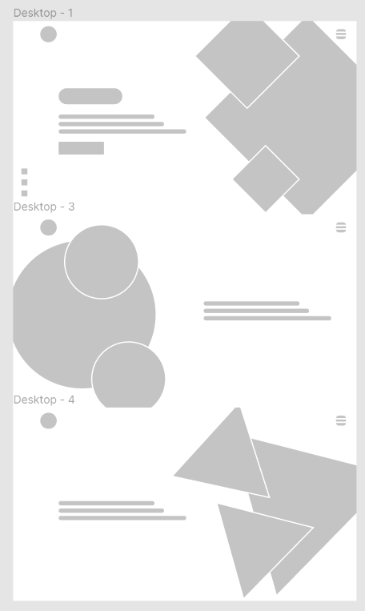

## Hugo Meireles

**Under construction**

This will give the online presence and keep tracking what I have learn and sheared same tips I thinks important.

  

  

  

Features:

- [ ] Home
  - [ ] Build entry Section
  - [ ] Build about Section
  - [ ] Build reason Section
- [ ] Learn Curve(blog)
- [ ] Tips

<h4 align="center">Wireframe</h4>

  

